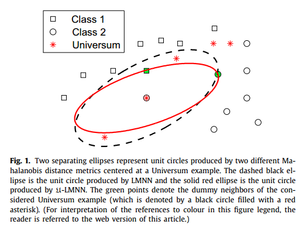

# U-LMNN
[Distance metric learning with the Universum](https://doi.org/10.1016/j.patrec.2017.09.031)

U-LMNN - Distance metric learning with the Universum

U-LMNN contains the implementation of Large Margin Nearest Neighbor (LMNN) with the Universum. Our implementation is baed on the implementation of LMNN (http://www.cs.cornell.edu/~kilian/code/code.html). For any question, please contact [Bac Nguyen](mailto:Bac.NguyenCong@ugent.be).

## Abstract
Universum, a set of examples that do not belong to any class of interest for a classification problem, has been playing an important role in improving the performance of many machine learning methods. Since Universum examples are not required to have the same distribution as the training data, they can contain prior information for the possible classifiers. In this paper, we propose a novel distance metric learning method for nearest-neighbor (NN) classification, namely -LMNN, that exploits prior information contained in the available Universum examples. Based on the large-margin nearest neighbor (LMNN) method, -LMNN maximizes, for each training example, the margin between its nearest neighbor of the same class and the neighbors of different classes, while controlling the generalization capacity through the number of contradictions on Universum examples. Experimental results on synthetic as well as real-world data sets demonstrate a good performance of -LMNN compared to the conventional LMNN method.

<div style="text-align:center">  </div>

### Prerequisites
This has been tested using MATLAB 2010A and later on Windows and Linux (Mac should be fine).

### Installation
Download the folder "U-LMNN" into the directory of your choice. Then within MATLAB go to file >> Set path... and add the directory containing "U-LMNN" to the list (if it isn't already). That's it.

### USAGE

Please run (inside the matlab console)
```matlab
demo  % demo of U-LMNN
```

## Authors

* [Bac Nguyen Cong](https://github.com/bacnguyencong)

## Acknowledgments
If you find this code useful in your research, please consider citing:
``` bibtex
@Article{NGUYEN201737,
  Title       = {Distance metric learning with the Universum},
  Author      = {Bac Nguyen and Carlos Morell and De Baets, Bernard},
  Journal     = {Pattern Recognition Letters},
  Year        = {2017},
  volume      = {100},
  pages       = {37-43},
  issn        = {0167-8655},
  doi         = {https://doi.org/10.1016/j.patrec.2017.09.031}
}
```

